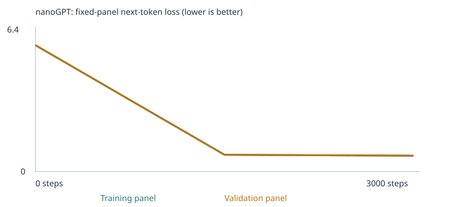
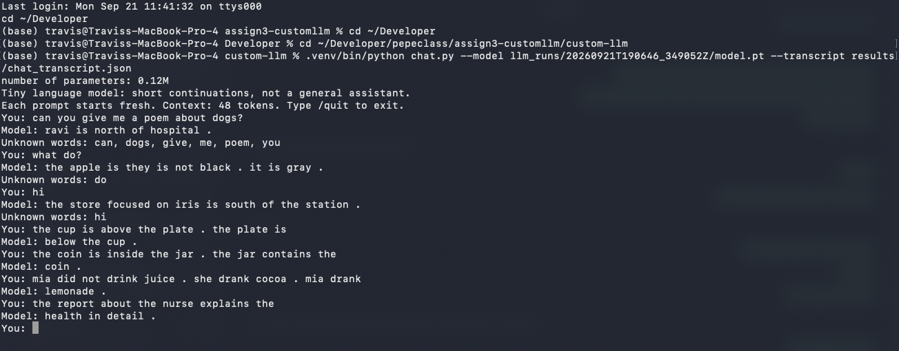

# Custom nanoGPT: starter corpus vs. a negation + spatial extension

Class 4 assignment, *From Zero to AI Agents* (Fall 26). I trained Karpathy's nanoGPT (2 blocks, 4 heads, 64-number
embeddings, 48-token context, word tokens) from scratch on CPU, twice: once on the supplied classroom corpus
(**Experiment A**) and once with added teaching stories for two extension skills, *negation* and *spatial relations*
(**Experiment B**). Both runs use identical settings, so the corpus is the only thing that changes. An optional third run
(**Experiment C**) trains on the *same words* as B with the sentences split apart, which separates vocabulary coverage
from pattern learning. All 48 fixed evals ran before and after training in every experiment.

## Results at a glance

| Experiment | Stage | Correct / 48 | Scorable / 48 | Accuracy among scorable cases | Full results |
|---|---|---:|---:|---:|---|
| A: starter corpus | Untrained | 9 | 24 | 37.5% | [CSV](llm_runs/20260921T190059_023596Z/language_evals/untrained/eval_results.csv) · [JSON](llm_runs/20260921T190059_023596Z/language_evals/untrained/eval_results.json) · [summary](llm_runs/20260921T190059_023596Z/language_evals/untrained/eval_summary.json) |
| A: starter corpus | Trained | 20 | 24 | 83.3% | [CSV](llm_runs/20260921T190059_023596Z/language_evals/final/eval_results.csv) · [JSON](llm_runs/20260921T190059_023596Z/language_evals/final/eval_results.json) · [summary](llm_runs/20260921T190059_023596Z/language_evals/final/eval_summary.json) |
| B: expanded corpus | Untrained | 10 | 30 | 33.3% | [CSV](llm_runs/20260921T190646_349052Z/language_evals/untrained/eval_results.csv) · [JSON](llm_runs/20260921T190646_349052Z/language_evals/untrained/eval_results.json) · [summary](llm_runs/20260921T190646_349052Z/language_evals/untrained/eval_summary.json) |
| B: expanded corpus | Trained | **30** | 30 | **100%** | [CSV](llm_runs/20260921T190646_349052Z/language_evals/final/eval_results.csv) · [JSON](llm_runs/20260921T190646_349052Z/language_evals/final/eval_results.json) · [summary](llm_runs/20260921T190646_349052Z/language_evals/final/eval_summary.json) |
| C: ablation (optional) | Untrained | 10 | 30 | 33.3% | [summary](llm_runs/20260921T190700_291475Z/language_evals/untrained/eval_summary.json) |
| C: ablation (optional) | Trained | 25 | 30 | 83.3% | [CSV](llm_runs/20260921T190700_291475Z/language_evals/final/eval_results.csv) · [summary](llm_runs/20260921T190700_291475Z/language_evals/final/eval_summary.json) |

**What changed.** The expanded corpus made exactly the 6 targeted cases scorable (coverage 24 → 30 of 48) and the trained
model answered all 6 correctly. Experiment C has the same vocabulary, the same scorable cases, and even the same initial
weights as B, yet scored 0/3 on negation and 1/3 on spatial relations. B's gain therefore came from *learning a pattern
that spans sentences*, not just from knowing the words. The other 18 extension cases stayed unscorable in every run
because their words never appear in any training text. These 48 public cases guided my corpus choices, so they are a
*development benchmark*, not an unseen test.

**Follow-up (36 more runs; [details](#follow-up-experiments-optional-seeds-training-length-learning-rate-depth)).**
Across 4 seeds, spatial relations held at 3/3 every time, but negation at the default settings was fragile (3, 3, 0, 2).
Training for 10,000 steps, or using learning rate 0.01, made negation 3/3 at every seed. A 1-layer model passed the
negation evals with a recency shortcut and failed the probes designed to catch that shortcut.

Executed notebooks: [A: starter](custom_llm_starter.ipynb) · [B: expanded](custom_llm_expanded.ipynb) ·
[C: ablation](custom_llm_ablation.ipynb). The unexecuted course template is [custom_llm.ipynb](custom_llm.ipynb).

## Repository map

| Path | What it is |
|---|---|
| `custom_llm_starter.ipynb`, `custom_llm_expanded.ipynb`, `custom_llm_ablation.ipynb` | The three executed experiments, with all outputs |
| `llm_runs/<run>/` and `llm_runs/<run>.zip` | Everything each run saved: config, corpus, manifest, vocabulary, split, inspections, losses, samples, evals, `model.pt`, `model_untrained.pt` |
| `corpus/negation.txt`, `corpus/spatial.txt` | Experiment B teaching material (original, synthetic) |
| `corpus_split/` | The same stories with normal `" . "` spacing, used only by Experiment C |
| `make_corpus.py` | Generates both corpora (seeded, reproducible) and enforces the separation rules |
| `check_leakage.py` | Independent leakage audit, stricter than the notebook's exact-match check |
| `evals/language_evals.json`, `run_evals.py` | The unchanged 48-case suite and the course runner |
| `probes/counterfactual_probes.json` | 12 extra probe cases I wrote after seeing B's results (see the evals section) |
| `results/rerun/` | All four A/B result sets regenerated from the saved weights with `run_evals.py` |
| `experiments/` | Follow-up sweep: runner, analysis script, the plan, `summary.csv` and `summary.md`, and 36 run folders (each with its model, losses, samples, evals and probes) |
| `probes/recency_trap_probes.json` | 6 probes where the correct word is not the most recent one (see Follow-up experiments) |
| `results/embeddings/neighbors.json` | Cosine neighbors before and after training, and the 3D-projection comparison |
| `results/leakage/` | Leakage audit reports for both corpora |
| `results/chat_transcript.json`, `results/chat_screenshot.png` | Chat evidence |
| `chat.py` | Terminal chat interface (course-supplied) |
| `nanogpt_model.py`, `NANOGPT_LICENSE` | Karpathy's nanoGPT `model.py`, pinned to commit `3adf61e`, MIT license |
| `UPSTREAM_README.md`, `ASSIGNMENT.md` | The course's original README and assignment text |

Run IDs: **A** = `20260921T190059_023596Z`, **B** = `20260921T190646_349052Z`, **C** = `20260921T190700_291475Z`.

## How to reproduce

```sh
python3 -m venv .venv && .venv/bin/pip install -r requirements.txt nbconvert
# Experiment A: corpus/ must hold only README.md
.venv/bin/jupyter nbconvert --to notebook --execute custom_llm_starter.ipynb --output rerun_A.ipynb
# Experiment B: regenerate the teaching stories, audit them, then train
.venv/bin/python make_corpus.py
.venv/bin/python check_leakage.py
.venv/bin/jupyter nbconvert --to notebook --execute custom_llm_expanded.ipynb --output rerun_B.ipynb
# Experiment C (optional)
.venv/bin/python make_corpus.py --out corpus_split --split-sentences
.venv/bin/jupyter nbconvert --to notebook --execute custom_llm_ablation.ipynb --output rerun_C.ipynb
```

Opening any notebook in Jupyter or VS Code and choosing Run All works too. Each run writes a new timestamped
`llm_runs/` folder. Note that `corpus/` must be empty (except its README) for Experiment A, because the notebook reads
every file in that folder. `make_corpus.py` uses a fixed seed, so it regenerates byte-identical files.

**Rerun the evals on the saved models** (no training, weights unchanged):

```sh
.venv/bin/python run_evals.py --model llm_runs/20260921T190646_349052Z/model.pt --output results/my-B-final
.venv/bin/python run_evals.py --model llm_runs/20260921T190646_349052Z/model_untrained.pt --stage untrained --output results/my-B-untrained
```

Use a fresh `--output` folder each time. I did this for all four A/B stages (`results/rerun/`): every case matched the
notebook's results exactly, 48/48 in each set, including the free-text continuations.

## My choices and prediction

| Setting | Value | Why |
|---|---|---|
| Corpus | A: `classroom` only. B: `classroom` + `corpus/negation.txt` + `corpus/spatial.txt` | Start from the supplied baseline, then change only the data |
| Training steps | 3,000 (both runs) | The course's starting budget. 3,000 steps × 32 passages is about 96,000 passage samples, roughly 23 passes over A's training set. (In hindsight: validation loss had nearly flattened by step 1,500.) |
| Learning rate | 0.001 (both runs), with warmup and cosine decay | A standard AdamW rate for a model this small. Too large and updates overshoot, so loss can oscillate or become NaN (the notebook stops on a nonfinite loss). Too small and 3,000 steps would not be enough to move the randomly initialized weights far from where they started |

The full predictions were written in each notebook's *My prediction* cell before that notebook ran. In short:
- **A:** loss starts near ln(vocabulary size) and falls well below 1. Starter patterns score high, transfer lower, and the 24 extension cases stay unscorable.
- **B:** the 6 targeted cases become scorable. Negation lands at 2–3 of 3 (the door case hardest) and spatial at 2 or better.
- **C:** same coverage as B, but negation and spatial near chance.

What actually happened is reported below, including where the predictions were wrong.

A 10-step setup check was run first in a scratch copy to confirm the environment. It was not kept as evidence.

## Corpus

**Sources and permissions.** Experiment A uses only the course's generated classroom sentences. Experiment B adds two
text files that I generated for this project with `make_corpus.py` (written with an AI coding assistant, Claude Code). They are
original synthetic sentences, not copied from any source, and are fine to publish. No PDFs were used, so there was no
PDF extraction to check. [`corpus_manifest.json`](llm_runs/20260921T190646_349052Z/corpus_manifest.json) records the file
hashes and shows no warnings or ignored files.

**Why negation and spatial relations.** In Experiment A all 24 extension cases were unscorable. The starter vocabulary
does not even contain `is`, `it`, `not`, or `she`. I picked two categories that test *structure* rather than stored facts:
- *Negation* asks the model to copy the value stated after a correction and ignore the negated one.
- *Spatial relations* ask it to invert a relation: above ↔ below, left ↔ right, north ↔ south, inside ↔ contains.

A tiny two-layer transformer can plausibly learn both, and they can be taught with completely different objects and
people. Fact-based categories such as opposites or everyday knowledge are hard to teach without restating the test
items.

**What the new material teaches.** 1,600 stories per file, each one line:

| Skill | Frames used (8 property, 6 action, 3–5 per spatial relation) | Examples from the corpus |
|---|---|---|
| Negation: property | not X … it is Y, questions, "thought it was", double negation | `the rug was not yellow .it was white .the rug was white .` |
| Negation: action | did not V X … V-ed Y, "instead", "wanted to … but did not" | `kai did not carry the bag .he carried the map instead .so kai carried the map .` |
| Spatial: vertical, horizontal, compass | relation then inverse, "so", "where is … ?", reversed order | `lucy put the basket below the bag .now the bag is above the basket .` |
| Spatial: containment, on/under, beside | inside ↔ contains, on ↔ under, symmetric beside | `the peach is inside the fridge .what does the fridge contain ?the fridge contains the peach .` |

Adding these files took the vocabulary from 136 to 319 types. That is still below the 509-type cap, so nothing
became `<UNK>` (training and held-out unknown rates 0.00% in both runs;
[A report](llm_runs/20260921T190059_023596Z/vocabulary_report.json),
[B report](llm_runs/20260921T190646_349052Z/vocabulary_report.json)).

**A pipeline problem I found: sentences were being split apart.** The notebook's `chunk_text()` splits passages at every
`[.!?]` followed by whitespace. A story like `the cup is not red . it is green . the cup is green .` would be stored as
three unrelated one-sentence passages, so the model could never see a premise and its conclusion together. The eval
prompts, however, are multi-sentence. My fix changes the data format, not the code. Inside a story I write `.it`
instead of `. it`. The tokenizer produces exactly the same tokens (`red`, `.`, `it`), but the chunker keeps the story as
one passage. Experiment C tests whether this mattered by training on the same stories with normal spacing. It did
matter; see the evals section.

**Keeping the exam out of the textbook.** `make_corpus.py` rejects any candidate story that breaks these rules, and
`check_leakage.py` re-audits the finished files:
1. No eval prompt appears in any passage (normalized match, like the notebook's check).
2. No passage contains 3 or more content words from any single eval case. For example, "lamp" + "above" + "below"
   is rejected, so the eval objects never appear in the relation they are tested on.
3. No passage contains all four answer choices of any case.
4. The eval answer pairs are never taught as a correction, in either order: red/blue, tea/milk, open/closed. So when
   B answers `blue` for the box, it must be copying from the prompt, because it never saw a red→blue correction.
5. The eval subjects `box`, `door`, and `ava` are never the subject of a negation. They appear only in other contexts,
   such as spatial stories.
6. Names from the reference-category evals (maya, leo, omar …) are not used at all.

Result: [0 violations in 3,200 passages](results/leakage/corpus.json). The longest run of consecutive tokens shared with
any eval prompt is 6 tokens, for example `is not red . it is` (lang_31) and `the desk . the desk is` (lang_41). These are shared sentence frames with different objects and answers, and every run is listed per case in the report. The audit refuses to
report a clean result if it finds no passages, and before scanning it proves it can catch a planted copy of a real eval
prompt. The notebook's own check also ran: 160 generated classroom sentences containing the 16 reserved starter
prefixes were withheld before the split in both runs ([A](llm_runs/20260921T190059_023596Z/eval_separation.json),
[B](llm_runs/20260921T190646_349052Z/eval_separation.json)). Both checks match word sequences, not meaning. A
paraphrase of a test item would pass them, which is why rules 2–5 exist and why I also reviewed the generated text by
eye.

## Runs

| | A: starter | B: expanded | C: ablation |
|---|---:|---:|---:|
| Completed steps | 3,000 (not interrupted) | 3,000 (not interrupted) | 3,000 (not interrupted) |
| Training time | 7.0 s | 10.0 s | 7.1 s |
| Parameters | 111,872 | 123,584 | 123,584 |
| Vocabulary (incl. `<UNK>`, `<BOS>`, `<EOS>`) | 136 | 319 | 319 |
| Unique passages (train / validation) | 4,592 (4,132 / 460) | 7,792 (7,012 / 780) | 10,738 (9,664 / 1,074) |
| Unknown-token rate (train / held-out) | 0.00% / 0.00% | 0.00% / 0.00% | 0.00% / 0.00% |
| Config · summary | [config](llm_runs/20260921T190059_023596Z/config.json) · [summary](llm_runs/20260921T190059_023596Z/training_summary.json) | [config](llm_runs/20260921T190646_349052Z/config.json) · [summary](llm_runs/20260921T190646_349052Z/training_summary.json) | [config](llm_runs/20260921T190700_291475Z/config.json) · [summary](llm_runs/20260921T190700_291475Z/training_summary.json) |

Hardware: Apple M5 Max laptop, macOS 26.6, PyTorch 2.14.0, Python 3.14.5, `DEVICE = "cpu"`. Parameter counts differ only
because the embedding table has one 64-number row per vocabulary entry.

**What stayed fixed:** seed 42, architecture, batch size 32, steps, learning-rate schedule, the 90/10 split method,
the evaluation panels (20 training + 20 validation documents), generation settings, and the 48 eval cases.
**What changed between A and B:** only the training text. **What changed only at inference:** temperature,
sampling seed, and the chat prompts. None of these touch the weights.

The split is by deduplicated passage, not by source file, so held-out passages share templates with training passages.
Validation loss therefore tests "new sentences from familiar templates," not new kinds of text.

## Loss evidence

<table><tr>
<td><b>A: starter</b><br></td>
<td><b>B: expanded</b><br></td>
</tr></table>

Every measured value is listed below (from each run's `history.json`). These are fixed panels of at most 20 training and 20
validation documents (exactly 20 + 20 here), averaged over non-padding next-token targets. They are small estimates,
not full-corpus losses.

| Step | A train | A validation | B train | B validation | C train | C validation |
|---:|---:|---:|---:|---:|---:|---:|
| 0 | 4.9263 | 4.9275 | 5.7760 | 5.7799 | 5.7689 | 5.7890 |
| 1,500 | 0.6821 | 0.7182 | 0.7652 | 0.7659 | 1.1600 | 1.1811 |
| 3,000 | 0.6783 | 0.7061 | 0.7229 | 0.7261 | 1.1466 | 1.1752 |

Links: history.json [A](llm_runs/20260921T190059_023596Z/history.json) · [B](llm_runs/20260921T190646_349052Z/history.json) · [C](llm_runs/20260921T190700_291475Z/history.json);
training.csv [A](llm_runs/20260921T190059_023596Z/training.csv) · [B](llm_runs/20260921T190646_349052Z/training.csv).

- **Sanity check on the starting point.** An untrained model should be close to guessing uniformly, so its loss
  should be about ln(vocabulary size). Measured 4.926 vs ln(136) = 4.913 for A, and 5.776 vs ln(319) = 5.765 for B.
  This confirms the loss is measuring what it should.
- **Most learning happens early.** Loss fell by more than 85% in the first 1,500 steps and barely moved after. The
  remaining ~0.7 is mostly *irreducible*: the templates choose adjectives, nouns, names, and colors at random, and no
  model can predict a coin flip.
- **Validation tracks training closely** (gaps 0.03 in A and 0.003 in B), as predicted. That does not demonstrate
  generalization beyond the templates.
- Losses across the three runs are *not* directly comparable, because the vocabularies and texts differ. C's higher
  final loss reflects a different task: its passages are single sentences whose first words are hard to predict,
  without the easily predicted endings of a full story.

## Samples: untrained, halfway, final

Same generation settings at every checkpoint (temperature 0.8, seed 2026, 4 samples, up to 32 tokens). The complete
files are in `samples/`: A [0](llm_runs/20260921T190059_023596Z/samples/step_0000.txt) ·
[1500](llm_runs/20260921T190059_023596Z/samples/step_1500.txt) · [3000](llm_runs/20260921T190059_023596Z/samples/step_3000.txt);
B [0](llm_runs/20260921T190646_349052Z/samples/step_0000.txt) · [1500](llm_runs/20260921T190646_349052Z/samples/step_1500.txt) ·
[3000](llm_runs/20260921T190646_349052Z/samples/step_3000.txt). Sample 4 of A and sample 1 of B are shown at each checkpoint:

| Step | Experiment A (starter) | Experiment B (expanded) |
|---:|---|---|
| 0 | `important hospital juice patient return recommended deposit tutor returned understand kitchen student design …` | `customer about dentist cooked drove suitcase farm quality at platform did mentioned not south focused …` |
| 1,500 | `our school has a question about the different instructor and course .` | `ravi did not carry the towel . he carried the ball instead . so jack found the ticket .` |
| 3,000 | `the consumer compared the offering after checking the price .` | `ravi did not carry the basket . he carried the ball instead . so ravi carried the ball .` |

- **Step 0** is word salad in both runs. The untrained model draws words almost uniformly, and most samples run to the
  32-token limit instead of ending.
- **Halfway**, A already writes perfect template sentences; samples 1 and 2 are identical at steps 1,500 and 3,000. B's halfway story
  is the clearest visible change in this project. It has the negation *shape* ("did not … instead . so …") but breaks
  the ending: the person, verb, and object all switch (`so jack found the ticket`). By step 3,000 the same slot copies
  correctly: `so ravi carried the ball`.
- **Experiment C** never writes a multi-sentence story (`ravi did not cook rice today .`), because every training
  passage was a single sentence.

## Token → ID → vector → gradient → update

From Experiment A ([tokenization.json](llm_runs/20260921T190059_023596Z/tokenization.json),
[inspection.json](llm_runs/20260921T190059_023596Z/inspection.json); B's equivalents are in its run folder).

**Text to IDs.** The first training passage, `today the school focused on lesson and the local professor .`, becomes
`<BOS>`=1, today=121, the=118, school=101, focused=42, on=74, lesson=61, and=7, the=118, local=63, professor=88,
.=3, `<EOS>`=2. Both occurrences of `the` get the same ID, 118. IDs are sorted-vocabulary row numbers, not
quantities: 121 is not "bigger" than 42 in any meaningful way.

**ID to vector.** The word `customer` is ID **28**. Row 28 of the 136 × 64 embedding table is its vector:

| | first 8 of 64 numbers | length (L2 norm) |
|---|---|---:|
| Before training | −0.0576, −0.0048, 0.0426, 0.0193, 0.0156, −0.0288, 0.0256, 0.0001 | 0.175 |
| After training | 0.0366, −0.0182, 0.1330, 0.1059, 0.0630, 0.0189, 0.1523, 0.0929 | 0.673 |

<details><summary>All 64 numbers, before and after</summary>

Before: -0.0576, -0.0048, 0.0426, 0.0193, 0.0156, -0.0288, 0.0256, 0.0001, 0.0247, 0.0207, 0.0074, -0.0331, -0.0535, -0.0057, -0.0242, -0.0147, 0.0047, -0.0105, -0.0084, -0.0183, -0.0201, 0.0051, -0.0109, -0.0126, 0.0284, -0.0026, -0.0041, 0.0136, -0.0099, -0.0167, 0.0019, -0.0015, 0.0160, -0.0057, -0.0007, -0.0013, -0.0073, -0.0009, 0.0015, -0.0050, -0.0290, 0.0181, -0.0073, -0.0054, 0.0156, -0.0045, 0.0416, 0.0524, 0.0226, -0.0154, -0.0251, -0.0068, 0.0294, -0.0025, 0.0298, -0.0228, -0.0302, 0.0064, 0.0505, 0.0075, -0.0107, 0.0247, -0.0145, 0.0132

After: 0.0366, -0.0182, 0.1330, 0.1059, 0.0630, 0.0189, 0.1523, 0.0929, -0.0632, -0.0173, 0.0341, -0.0474, -0.0646, -0.0866, -0.1450, -0.0359, -0.1569, -0.1503, -0.0076, -0.0707, -0.0930, 0.0091, -0.0648, 0.0175, 0.0039, -0.0625, 0.1125, -0.0643, 0.0520, -0.1567, -0.0706, 0.0617, -0.0318, 0.1414, 0.0913, 0.0565, 0.0196, -0.1348, 0.1223, -0.0338, 0.1187, 0.0046, -0.1344, 0.0529, -0.0376, -0.1031, 0.0203, 0.0381, -0.0198, -0.1507, 0.0303, -0.1206, 0.0166, 0.0778, 0.1181, 0.0557, 0.0934, 0.0026, 0.0371, 0.0756, 0.1185, 0.0144, 0.0913, -0.0746
</details>

The trained vector is almost 4× longer, and its cosine similarity with the starting vector is only 0.20, so training
rewrote it rather than nudging it. The ID never changed. Only the numbers stored at that row did.

**One real gradient and update** (the first training step, coordinate 0 of `customer`'s vector):

| before | gradient | learning rate at step 1 (warmup) | after | change |
|---:|---:|---:|---:|---:|
| −0.05759192 | +0.00069259 | 0.00001 | −0.05760191 | −0.00000999 |

The gradient is positive: nudging this number up would slightly *increase* the loss on that batch. So the optimizer
moved it down. The size of the move is the telling detail: it is almost exactly the learning rate (1e-5), not learning
rate × gradient (which would be 7e-9). On its first step, AdamW divides the gradient by a running estimate of its own
magnitude, so every parameter moves by about ±lr, whatever its gradient's size. Weight decay then pulls the value
back toward zero by 0.00001 × 0.01 × 0.0576 ≈ 6e-9, which is why the change is 0.00000999 rather than exactly
0.00001. This is why the notebook warns that AdamW is not plain "learning rate times
gradient".

**Next-token probabilities for the prefix `the customer`:**

| | top five next tokens |
|---|---|
| Before training | customer 0.016, bus 0.011, educator 0.010, us 0.010, application 0.010 (almost flat; 1/136 = 0.007) |
| After training | reviewed 0.178, recommended 0.171, ordered 0.169, selected 0.163, compared 0.160 |

After training, almost all probability sits on the verbs that follow `the <noun>` in the templates, split nearly evenly
because the corpus uses each verb about equally often.

**Attention** (block 1, head 1, over `<BOS> the customer`): the row for `customer` puts 0.49 of its attention on `<BOS>`,
0.42 on `the`, and 0.09 on itself. Each row only has weights for earlier positions (and itself): the causal mask forces
the weights for future tokens to exactly zero.

## Neighbors: what the embeddings learned

My Experiment A prediction said `customer` would move closer to words it appears *with*, such as `service` and `store`.
**That prediction was wrong.** Cosine similarity over all 64 numbers
([`experiments/embedding_neighbors.py`](experiments/embedding_neighbors.py), [results](results/embeddings/neighbors.json)):

| Word (run) | Nearest before training | Nearest after training (64D cosine) |
|---|---|---|
| customer (A) | bus 0.21, educator 0.20, helped 0.20 (noise) | **shopper 0.98, client 0.98, buyer 0.98**, subscriber 0.97, consumer 0.97 |
| service (A) | instructor 0.25, explains 0.24 (noise) | **purchase 0.99, order 0.99, support 0.99**, store 0.40 |
| above (B) | client 0.38, learned 0.38 (noise) | **below 0.76**, beside 0.53, under 0.49, inside 0.47 |
| left (B) | reviewed 0.36, right 0.35 | **right 0.78**, south 0.55, north 0.43 |
| blue (B) | owen 0.32, ruby 0.28 (noise) | **gray 0.84, brown 0.84, yellow 0.83**, white 0.82, green 0.81 |
| milk (B) | brought 0.42, anna 0.27 (noise) | **tea 0.89**, coffee 0.84, cider 0.80, cocoa 0.78, lemonade 0.75 |

Embeddings grouped words that are **interchangeable in the same slot** of a sentence, not words that occur together.
The six customer nouns fill the same `{noun}` position in every template, so they became near-duplicates. `service`
sits in a different slot (`{context}`), so it clustered with the other context words instead. For the same reason,
opposites end up close together: `above` and `below` fill the same position ("the cup is ___ the plate"). Their
meaning is opposite, but their usage is almost identical.

This also helps explain the thinnest eval margin. `milk` and `tea`, the two candidates in lang_32, are each other's
nearest neighbors (0.89), so the embedding alone barely distinguishes them. Picking the right one depends on attention
copying the word that followed "she bought".

**Why the 3D map is imperfect.** The embedding viewer compresses 64 numbers into 3 with PCA. A 3D PCA of the final
table keeps only **41% of the variance in A and 21% in B**, and 3D neighbors often disagree with the real ones:

| Word (run) | 64D neighbors | 3D PCA neighbors | Overlap |
|---|---|---|---:|
| customer (B) | client, consumer, buyer, subscriber, shopper | shopper, buyer, consumer, client, subscriber | 5/5 |
| blue (B) | gray, brown, yellow, white, green | green, white, brown, eggs, max | 3/5 |
| left (B) | right, south, north, below, to | a, where, the, what, find | 0/5 |
| milk (B) | tea, coffee, cider, cocoa, lemonade | mango, banana, pear, peach, lake | 0/5 |

Strong, dominant clusters (the customer synonyms) survive the projection; finer distinctions (drinks vs. fruit,
directions vs. question words) do not. Distances on the map are a rough picture; cosine over all 64 numbers is the
real measurement.

## Temperature comparison

Same trained model, starting token, and seed (2026); only temperature changes, and no weights change
([A](llm_runs/20260921T190059_023596Z/temperature_comparison.json) · [B](llm_runs/20260921T190646_349052Z/temperature_comparison.json)).

| Temperature | A: sample 4 | B: sample 1 |
|---:|---|---|
| 0.3 | `the local consumer was mentioned in the purchase report yesterday .` | `the local dentist was mentioned in the treatment report yesterday .` |
| 0.8 | `the consumer compared the offering after checking the price .` | `ravi did not carry the basket . he carried the ball instead . so ravi carried the ball .` |
| 1.2 | `the consumer compared the offering after checking the price .` | `ravi did not cook rice today . he cooked pear . what did ravi eat ? ravi cooked eggs .` |

Temperature divides the model's scores before they are turned into probabilities. Low values sharpen the distribution
toward the likeliest word, and high values flatten it. In A, 0.8 and 1.2 produced *identical* text for all four
samples: the trained distributions are so peaked that flattening them did not change where the same random draw landed.
In B, 1.2 breaks the negation pattern (`what did ravi eat ? ravi cooked eggs`: wrong verb and wrong food), because
flattening gives the wrong foods enough probability to be sampled.

## Evals

The [48-case suite](evals/language_evals.json) was used unchanged (suite SHA-256 `1d7c503f…`, recorded in every
summary), run by the course's [`run_evals.py`](run_evals.py) ([guide](evals/README.md)).
- **Multiple-choice score:** only the prompt goes into the model. A case scores 1 if the correct word has the highest
  probability among its four choices; a tie scores 0.
- **Coverage:** a case with any unknown word in its prompt or choices is marked `out_of_vocabulary`, so an `<UNK>`
  match can't earn lucky credit. It counts as 0 in the all-case rate.
- **Free continuation:** saved separately (temperature 0.8, fixed seed, 24 tokens). It is not graded.

### By group and category

| Group / category | Cases | A untrained | A trained | B untrained | B trained | C untrained | C trained |
|---|---:|---:|---:|---:|---:|---:|---:|
| **starter_patterns** | 16 | 6/16 | 16/16 | 6/16 | 16/16 | 6/16 | 16/16 |
| &nbsp;&nbsp;domain_context | 8 | 3/8 | 8/8 | 4/8 | 8/8 | 4/8 | 8/8 |
| &nbsp;&nbsp;domain_place | 8 | 3/8 | 8/8 | 2/8 | 8/8 | 2/8 | 8/8 |
| **starter_transfer** (new_wording) | 8 | 3/8 | 4/8 | 2/8 | 8/8 | 2/8 | 8/8 |
| **extend_corpus** | 24 | 0 (0 scorable) | 0 (0 scorable) | 2 (6 scorable) | **6 (6 scorable)** | 2 (6 scorable) | 1 (6 scorable) |
| &nbsp;&nbsp;negation *(targeted)* | 3 | 0 (0 scorable) | 0 (0 scorable) | 1/3 | **3/3** | 1/3 | 0/3 |
| &nbsp;&nbsp;spatial_relations *(targeted)* | 3 | 0 (0 scorable) | 0 (0 scorable) | 1/3 | **3/3** | 1/3 | 1/3 |
| &nbsp;&nbsp;grammar, opposites, reference, sequence, everyday_knowledge, categories_and_analogies | 18 | 0 (0 scorable) | 0 (0 scorable) | 0 (0 scorable) | 0 (0 scorable) | 0 (0 scorable) | 0 (0 scorable) |

The complete per-category tables are in each `eval_summary.json`. A-vs-B comparisons:
[language_eval_comparison.json A](llm_runs/20260921T190059_023596Z/language_eval_comparison.json) ·
[B](llm_runs/20260921T190646_349052Z/language_eval_comparison.json).

### The six targeted cases, with probabilities and free continuations

| Case | Prompt (all the model sees) | Expected | B untrained | B trained: pick (p) | B trained free continuation | C trained: pick (p) |
|---|---|---|---|---|---|---|
| lang_31 | `the box is not red . it is blue . the box is` | blue | blue (0.004) | **blue (0.365)** | `blue .` | yellow (0.024) |
| lang_32 | `ava did not buy tea . she bought milk . ava bought` | milk | tea (0.003) | **milk (0.081)**, tea 0.052 | `treatment bought cocoa .` | rice (0.002) |
| lang_33 | `the door is not open . it is closed . the door is` | closed | wide (0.003) | **closed (0.179)**, missing 0.098 | `missing .` | missing (0.000) |
| lang_40 | `the book is inside the bag . the bag contains the` | book | lamp (0.004) | **book (0.802)** | `book .` | book (0.004) |
| lang_41 | `the lamp is above the desk . the desk is` | below | below (0.004) | **below (0.995)** | `below the lamp .` | above (0.037) |
| lang_42 | `the ball is left of the box . the box is to the` | right | south (0.003) | **right (0.963)** | `right of the ball .` | left (0.031) |

In Experiment A all six were `out_of_vocabulary`. **What worked:**
- **Spatial relations were learned strongly.** The model puts over 80% of its probability on the answer, and its free
  continuations are complete, correct sentences (`below the lamp .`, `right of the ball .`).
- **Negation was learned, but weakly.** Every pick is correct, yet the margins are thin. In lang_32, milk beats tea only
  0.081 to 0.052: the model has learned to give some probability to the nouns that appeared in the story, and only a
  modest edge to the correct one.

**Failures:**
- **Multiple-choice and free text disagree.** The free continuations for lang_32 (`treatment bought cocoa .`) and
  lang_33 (`missing .`) are wrong even though the picks were right. With the probability spread across many
  plausible words, sampling at 0.8 often lands elsewhere.
- **The 18 untargeted cases never became scorable.** Their words (`opposite`, `walked`, `freezes`, `puppy` …) appear in no
  training text. More training steps cannot fix that; only new data can.

### Vocabulary coverage vs. learned patterns

- **The targeted gain (0 → 6 correct) is both coverage and patterns, and Experiment C separates the two.** The
  vocabularies are the same, and so are the scorable cases. Even the untrained model is identical: both untrained
  checkpoints hash to `0ab05abe…`, because the same vocabulary and seed give the same starting weights. The only
  difference is whether a story's sentences share a passage. C falls to 0/3 on negation and 1/3 on spatial, with
  near-uniform probabilities. **Coverage made the cases scorable; learning the multi-sentence pattern made them
  correct.**
- **The starter-transfer gain (4/8 → 8/8) is not something I can attribute.** It rose in both B and C, so it did not come
  from the multi-sentence stories. It also rests on weak evidence: in A, three of the four "correct" transfer cases had
  probability ≈ 0.000 on *all four* choices, so they were ranked among near-zeros. In addition, A's different vocabulary
  size gives it different random starting weights than B and C. The data change and the initialization are
  confounded here, and one run per corpus cannot separate them. *(The follow-up seed sweep settled this: A alone
  ranges 4–7/8 across seeds, and B and C 5–8, so the jump was mostly seed noise.)*

### Extra check: are the answers coming from the story?

A 6/6 score could also come from bias: a model that always says `below` after `the desk is` would pass lang_41 without
reading the story. So after seeing B's results I wrote 12 extra cases ([probes/counterfactual_probes.json](probes/counterfactual_probes.json)):
- the six targeted evals with the premise *reversed*, so the correct answer changes (e.g. `the lamp is below the desk . the desk is` → above);
- six fresh stories with objects and people from no eval.

They were run with the unchanged runner (`run_evals.py --suite probes/counterfactual_probes.json`) and never used for
training or corpus choices. Because they were written after seeing the results, they are a sanity check, not an
untouched test.

| | reversed premise (6) | fresh stories (6) |
|---|---:|---:|
| B trained | **6/6** | **6/6** |
| C trained | 3/6 | 2/6 |

B follows the story: reversed spatial premises flip its answer at 0.99 probability. Negation margins stay thin: with
tea and milk swapped, it picks tea 0.074 over milk 0.060. C is near chance, and its correct picks win by margins such
as 0.038 vs 0.033. Full results: [B](results/probes_B/eval_results.json) · [C](results/probes_C/eval_results.json).

## Chat interface

The terminal interface [`chat.py`](chat.py) loads a saved `model.pt` and its saved vocabulary, and generates replies
from that nanoGPT. Nothing else is involved: no other model, no API, no canned text. It never trains, and it never adds
chat text to the corpus.

```sh
.venv/bin/python chat.py --model llm_runs/20260921T190646_349052Z/model.pt --transcript results/chat_transcript.json
```

Type a prompt and press Enter; `/quit` saves the transcript. The model used is **Experiment B, trained**, 3,000 steps
(model SHA-256 `dff0528a…`, recorded in the transcript). It is a tiny language model: it *continues* text rather than answering.
Every prompt starts fresh with no memory of earlier turns, at temperature 0.8 and up to 24 new tokens, with a new seed
per turn. Only the last 48 tokens fit in the context window. Unknown words are listed after each reply and enter the
model as `<UNK>`.



Transcript: [results/chat_transcript.json](results/chat_transcript.json)

| Prompt | Reply | Note |
|---|---|---|
| `can you give me a poem about dogs?` | `ravi is north of hospital .` | 6 of 8 words unknown; the model gets almost no signal and falls back on its most common kind of sentence |
| `what do?` | `the apple is they is not black . it is gray .` | Ungrammatical; mixes a negation story into nonsense |
| `hi` | `the store focused on iris is south of the station .` | Starts a starter template and switches into a spatial story mid-sentence |
| `the cup is above the plate . the plate is` | `below the cup .` | Correct inverse relation, on objects from no eval |
| `the coin is inside the jar . the jar contains the` | `coin .` | Correct containment |
| `mia did not drink juice . she drank cocoa . mia drank` | `lemonade .` | **Failure:** should be `cocoa`. The model knows a drink comes next but does not copy reliably, matching the thin negation margins above |
| `the report about the nurse explains the` | `health in detail .` | A starter pattern, reproduced exactly |

**Limitation shown:** outside its training patterns the model has nothing to work with. Most of a normal question
becomes `<UNK>`, and even the words it knows get stitched into templates regardless of meaning.

## What I learned (in my own words)

**1. What is my corpus, what can it teach, and what is missing? Why hold data out?**

This corpus is extremely limited. The starter corpus had only 133 distinct words, and it didn't even include words like
"it," "is," or "not," so the model is always going to be very limited. It's missing a ton of contextual information and
can only continue a few basic sentence patterns.

The holdout data is extremely important in machine learning. We can train all we want, but training alone can lead to
overfitting (i.e., the model just memorizing the training data), so we test it against a holdout set that is never used
for training, and then compare the two losses. We're at 0.678 on training and 0.706 on validation, so the model is not
just memorizing individual sentences. One caveat: the split is by passage, so validation sentences come from the same
templates as training. That shows the model handles new sentences from familiar templates, not new kinds of text.

**2. How do a token, token ID, vector, and embedding differ?**

The token is simply a unit of text; in this project that's a whole word or a punctuation mark (other models also split
words into smaller pieces). The ID is just the identifier given to the token. For example, "customer" was ID 28, so it
maps to row 28 of a 136-by-64 embedding table: 136 vocabulary entries with 64 numbers each. The vector is simply a list
of numbers, 64 of them in this case. The embedding is the learned vector stored at the token's row. It's essentially
where the model keeps what it has learned about that word, although that is only partially true: much of what the model
knows also lives in the attention and feed-forward weights, not only in the embedding row. The ID never changes during
training, but the vector does; after training, row 28 pointed in a very different direction (cosine similarity 0.20 with
its starting values).

**3. What makes this a neural network? How did loss, gradients, and the optimizer change its weights?**

What makes this a neural network is that it's a large function made of layers of adjustable numbers, which are the
weights, with nonlinear steps between them. We have two transformer blocks and 111,872 weights in total. We start with
random weights, have the model predict the next word, and measure how far those predictions are from the actual next
words; that gap is the loss. The loss here is cross-entropy, and it fell from 4.93 (about what you get by guessing
randomly among 136 words) to 0.68 after 3,000 steps. We use backpropagation to compute the gradient, which is each
weight's marginal effect on the loss, and then the optimizer, AdamW, nudges the weights in the direction that reduces
the loss. For example, the first number in "customer"'s vector had a gradient of +0.00069. Positive means raising this
weight raises the loss, so the optimizer lowered it, from −0.0575919 to −0.0576019.

**4. What does attention combine, and why can it not look at future tokens?**

*Attention Is All You Need.* For each word, attention asks which earlier words matter for predicting what comes next,
and then takes a weighted blend of those words. The weights are computed fresh for each sentence based on what's
actually behind it. In my run, "customer" put 0.49 of its attention on the start token, 0.42 on "the," and 0.09 on
itself. There's also a no-future rule, the causal mask, to avoid look-ahead bias. Training asks the model to predict the
next word; if it could see the next word, it would simply copy it and learn nothing. It also can't use future words when
generating, because the future hasn't been written yet. Experiments B and C show why attention over earlier sentences
matters: B learned to reach back to the corrected word ("it is blue") and scored 3/3 on negation, while C, trained on
the same words with every sentence split apart, never saw a premise and its question together and scored 0/3.

**5. How do probabilities become generated text? What changed with temperature, and did any weights change?**

Text generation is a loop. The model scores every word in its vocabulary, turns those scores into probabilities, then
randomly draws one word according to those probabilities. It appends that word and repeats the process until it reaches
the end token or hits a length limit.

Low temperature piles more probability onto the most likely word, and high temperature spreads it out toward less
likely words. High temperature is more error-prone but also more creative. Low temperature is not quite deterministic,
but it's the closest thing to a deterministic response. In technical terms, the raw scores are logits, and the model
simply divides them by the temperature before the softmax. No weights change: it's the same trained model, and only the
sampling setting is different.

In Experiment A, temperatures 0.8 and 1.2 produced identical text for all four samples. The trained distributions were
so peaked that flattening them didn't change where the same draw landed. In Experiment B, temperature 1.2 broke the
negation pattern: `what did ravi eat ? ravi cooked eggs` has the wrong verb and the wrong food.

**6. Did the samples and both loss curves support my prediction? What can I honestly conclude?**

Mostly, yes. The loss started near a random guess and fell below 1, validation loss tracked training loss, the expanded
corpus made exactly the 6 targeted cases scorable, and negation and spatial relations both scored 3/3 (although negation
won by thin margins, like milk 0.081 vs. tea 0.052). One thing I didn't predict was the starter-transfer score jumping
from 4/8 to 8/8, and I can't attribute that to the corpus because the starting weights also changed.

The model learned narrow patterns inside its templates, and with the right multi-sentence data that includes copying
from context and inverting relationships like above/below. Coverage decided which cases could be scored; pattern
learning decided which were right. What I can't claim is that it understands negation or space in general. These 48
tests guided my choices, and the chat transcript shows it falls apart on anything outside its training patterns.

## Follow-up experiments (optional): seeds, training length, learning rate, depth

The required comparison rests on one run per corpus. So I reran the experiment 36 more times, changing one setting at a time,
to see which conclusions survive. Every run uses the notebook's own code
([`experiments/run_experiment.py`](experiments/run_experiment.py) executes the code cells of `custom_llm.py`, which are
identical to the notebook's), the same corpus files, and the same unchanged 48 evals.
- **Checks on the runner itself.** Each override must match its line in the source exactly once, and each run's
  `config.json` must record the requested value, or the run stops. At seed 42 with default settings, the runner
  reproduced all three notebook runs exactly: same model hashes, same loss history, and the same 48/48 results in every
  eval set. [`experiments/analyze.py`](experiments/analyze.py) re-checks this and refuses to summarize if any two runs
  produced an identical model, which would mean an override silently failed.
- **What a seed changes.** The single `SEED` controls the train/validation split, the starting weights, and the batch
  order together. The spread across seeds is therefore ordinary run-to-run variation. Vocabulary and eval coverage were
  the same in every run (24/48 scorable for A, 30/48 for B and C). The one exception: two C runs lost the word `wrong`,
  which no eval uses.
- **Extra probes.** Every model was also scored on the 12 flip/fresh probes and on 6 new **recency traps**
  ([`probes/recency_trap_probes.json`](probes/recency_trap_probes.json)). In the traps, the correct word comes *first* and
  the negated word comes *last* (`the kite is pink , not green . the kite is` → pink). Like the other probes, they were
  written after seeing results and never used for training.

Per-seed values, in seed order 42 / 1 / 2 / 3 (full table: [`experiments/summary.csv`](experiments/summary.csv); every run's
model, losses, samples and eval files are in [`experiments/runs/`](experiments/runs/)). **Margin** = p(correct) − p(best
wrong choice), averaged over a category's 3 cases.

| Condition | Seeds | Correct /48 | Transfer /8 | Negation /3 | Spatial /3 | Negation margin | Spatial margin | Flip probes /6 | Fresh probes /6 | Recency traps /6 | Val loss |
|---|---|---:|---:|---:|---:|---:|---:|---:|---:|---:|---:|
| A | 42, 1, 2, 3 | 20 / 22 / 23 / 23 | 4 / 6 / 7 / 7 | 0 / 0 / 0 / 0 | 0 / 0 / 0 / 0 | n/a | n/a | 0 / 0 / 0 / 0 | 0 / 0 / 0 / 0 | n/a | 0.71 / 0.68 / 0.70 / 0.69 |
| B | 42, 1, 2, 3 | 30 / 28 / 27 / 29 | 8 / 6 / 8 / 8 | 3 / 3 / 0 / 2 | 3 / 3 / 3 / 3 | 0.12 / 0.27 / -0.03 / 0.00 | 0.91 / 0.85 / 0.88 / 0.95 | 6 / 6 / 6 / 4 | 6 / 6 / 6 / 6 | 5 / 6 / 5 / 6 | 0.73 / 0.77 / 0.83 / 0.81 |
| C | 42, 1, 2, 3 | 25 / 26 / 23 / 28 | 8 / 7 / 5 / 8 | 0 / 1 / 0 / 1 | 1 / 2 / 2 / 3 | -0.00 / -0.00 / -0.00 / -0.00 | -0.00 / -0.00 / 0.00 / 0.00 | 3 / 0 / 3 / 1 | 2 / 2 / 0 / 0 | 1 / 1 / 1 / 1 | 1.18 / 0.99 / 1.14 / 1.06 |
| B_layers1 | 42, 1, 2, 3 | 28 / 29 / 29 / 29 | 8 / 8 / 8 / 8 | 2 / 2 / 3 / 2 | 2 / 3 / 2 / 3 | 0.17 / 0.13 / 0.14 / 0.11 | 0.30 / 0.36 / 0.51 / 0.44 | 6 / 5 / 5 / 4 | 6 / 5 / 5 / 5 | 3 / 3 / 3 / 4 | 0.75 / 0.79 / 0.85 / 0.84 |
| B_layers4 | 42, 1, 2, 3 | 30 / 28 / 30 / 30 | 8 / 8 / 8 / 8 | 3 / 1 / 3 / 3 | 3 / 3 / 3 / 3 | 0.28 / -0.02 / 0.13 / 0.13 | 0.85 / 0.95 / 0.96 / 0.91 | 6 / 4 / 6 / 5 | 6 / 5 / 6 / 6 | 5 / 4 / 6 / 5 | 0.72 / 0.79 / 0.82 / 0.81 |
| B_lr0.0001 | 42, 1, 2, 3 | 4 / 6 / 8 / 8 | 1 / 2 / 3 / 3 | 0 / 0 / 1 / 0 | 1 / 2 / 1 / 1 | -0.00 / -0.01 / -0.00 / -0.01 | -0.00 / 0.00 / -0.00 / -0.00 | 3 / 2 / 3 / 3 | 4 / 1 / 3 / 4 | 2 / 2 / 1 / 2 | 1.40 / 1.50 / 1.71 / 1.83 |
| B_lr0.01 | 42, 1, 2, 3 | 28 / 30 / 30 / 26 | 7 / 8 / 8 / 5 | 3 / 3 / 3 / 3 | 2 / 3 / 3 / 2 | 0.96 / 0.98 / 0.98 / 0.98 | 0.66 / 0.85 / 0.67 / 0.50 | 6 / 6 / 6 / 6 | 6 / 6 / 6 / 6 | 5 / 6 / 5 / 6 | 0.74 / 0.76 / 0.82 / 0.77 |
| B_lr0.03 | 42, 1, 2, 3 | 26 / 26 / 28 / 25 | 4 / 6 / 7 / 4 | 3 / 3 / 3 / 3 | 3 / 1 / 2 / 2 | 0.99 / 0.97 / 0.80 / 0.99 | 0.66 / 0.27 / 0.59 / 0.66 | 6 / 6 / 5 / 6 | 6 / 6 / 6 / 6 | 5 / 6 / 4 / 6 | 0.72 / 0.74 / 0.78 / 0.76 |
| B_steps10000 | 42, 1, 2, 3 | 29 / 28 / 28 / 30 | 7 / 6 / 6 / 8 | 3 / 3 / 3 / 3 | 3 / 3 / 3 / 3 | 0.94 / 0.84 / 0.79 / 0.94 | 1.00 / 0.72 / 0.97 / 0.99 | 6 / 6 / 6 / 6 | 6 / 6 / 6 / 6 | 6 / 6 / 6 / 6 | 0.80 / 0.90 / 0.92 / 0.88 |

**1. Seeds: spatial is robust, negation is fragile.**
- **Spatial:** B scored 3/3 at every seed, with margins of 0.85–0.95.
- **Negation:** the graded run's 3/3 was partly a good draw. Across seeds B scored 3, 3, 0, 2, with margins near zero at
  two of them.
- **Experiment C:** near chance at every seed (negation 0–1, margins ≈ 0), so the main conclusion holds. Keeping a
  story's sentences together is what makes the pattern learnable.
- **Starter transfer:** A alone ranged 4–7/8 across seeds, and B and C 5–8. The 4/8 → 8/8 jump in the main table was
  mostly seed noise.

**2. Training length: the "next experiment" I proposed, now run.** At 10,000 steps, B scored 3/3 on negation and 3/3 on
spatial at *every* seed. The negation margin widened to 0.79–0.94, and every flip, fresh and recency probe passed
(72/72). That matches my prediction that the copy pattern was still being learned at step 3,000.

The surprise is that **validation loss got worse** (0.73–0.83 → 0.80–0.92) while the skill got better. Loss averages over
every token, most of which are unpredictable names, colors and objects. Longer training most likely made the model
overconfident on those, while the answer token that the evals measure is a tiny share of the total. Loss alone would
have told me to stop early.

**3. Learning rate: this puts real evidence behind the "too small / too large" question.**
- **0.0001 is too small.** After 3,000 steps the model had barely learned: 4–8/48, with validation loss 1.40–1.83.
- **0.01 learned negation far better** than the default 0.001: 3/3 at every seed, with margins 0.96–0.98 instead
  of ≈0.1. Spatial was slightly weaker (2–3/3).
- **0.03 is too large, but it didn't crash.** Warmup and gradient clipping keep it stable, and the loss looks normal.
  Instead it does worse on spatial (1–3/3) and transfer (4–7/8).
- **Loss can't see these differences.** Validation loss at 0.01 and 0.001 is about the same, even though the negation
  behavior is completely different.

**4. Architecture: how many layers the copy needs.** One layer (73,600 parameters) versus the default two (123,584) versus
four (223,552), all on corpus B.
- **One layer still passed 2–3 of the 3 negation evals, but that was a shortcut.** All three eval cases put the correct
  word *last* ("not red . it is **blue**"), so "pick the most recent color or food" passes them. On the recency traps,
  where that shortcut gives the wrong answer, the 1-layer model scored only 3–4/6 and chose the negated word 1–3 times.
- **Two and four layers scored 4–6/6 on the traps.** In a trap the correct word is the one that followed the same
  phrase earlier ("the kite is **pink** … the kite is"). Copying "what came after this phrase last time" is the job of an
  **induction head**, a pair of attention layers working together (Olsson et al., 2022). A single layer cannot build one.
- **Four layers added little over two** on this small corpus, and at one seed negation dropped to 1/3.
- **Spatial margins fell to 0.30–0.51 with one layer**, versus 0.85–0.95 with two.

These results are consistent with the induction-head account, but I did not inspect individual attention heads, so they
support it rather than prove it.

**What this changes.**
- The graded Experiment B, and the model used in the chat, remain the seed-42 default run. Nothing above replaced it.
- If I were training the final model again, I would use corpus B with 10,000 steps (or learning rate 0.01).
- The largest weakness revealed is in the evals: the three negation cases can be passed with a recency shortcut.
- All of this is still development evidence. The probes were written after seeing results, and 4 seeds per condition is
  a small sample.

Reproduce: `python experiments/run_experiment.py --name B_seed1 --corpus corpus --seed 1` (see the file for all
options). Then score the traps with `python run_evals.py --model experiments/runs/B_seed1/model.pt --suite
probes/recency_trap_probes.json --output experiments/runs/B_seed1/recency_probes`, and run
`python experiments/analyze.py`. The full plan is in [`experiments/plan.txt`](experiments/plan.txt). Runs took 10–50
seconds each, 4 at a time.

## Limitation and next experiment

**Observed limitation.** Negation was learned only weakly. The model picks the right word among four, but with small
margins (milk 0.081 vs tea 0.052), and free sampling often names a different item (`lemonade`, `missing`,
`treatment bought cocoa`). Spatial relations, in contrast, are near-deterministic (0.96–0.995). The difference fits the
tasks. Spatial answers are a fixed flip (`above` always pairs with `below`), which the model can store as a word-to-word
rule. Negation requires copying an arbitrary word from earlier in the context, which a two-layer, 64-dimension model
does less reliably after 3,000 steps.

**Next experiment (proposed, then run).** I proposed rerunning Experiment B with 3 more seeds and with 10,000 steps.
I predicted spatial would stay at 3/3, negation margins would widen with more steps, and the transfer score would vary
by seed. All three held; see [Follow-up experiments](#follow-up-experiments-optional-seeds-training-length-learning-rate-depth).

**The next one after that.** Write a fresh negation test set *before* training, and never let it guide the corpus. In it,
the correct word would be neither the most recent candidate nor the one after a repeated phrase, for example
`the box is not red . it is blue . what color is the box ? it is`. Train corpus B with 10,000 steps across several
seeds. My prediction: the 2-layer model keeps most of its accuracy, and the 1-layer model falls to chance. That would be
the first result here that is not a development-benchmark number.

## Notes on honesty and scope

- The 48 cases are public and guided my choice of categories, so B's 6/6 is a development-benchmark result on narrow
  next-word tests. It does not show that the model understands negation or space in general, and the chat transcript
  shows how narrow it is.
- An AI coding assistant (Claude Code) helped write `make_corpus.py`, `check_leakage.py`, the probe cases, and this
  README's evidence sections. The "What I learned" answers are my own, dictated and then edited for clarity and
  technical accuracy. All numbers come from the saved run files linked above. The model is Karpathy's nanoGPT,
  trained from scratch; no pretrained weights and no API were used.
- The unexecuted `custom_llm.ipynb` and `custom_llm.py` are the course template, left unchanged. My runs use copies,
  edited only in the settings cell and the prediction cell.
